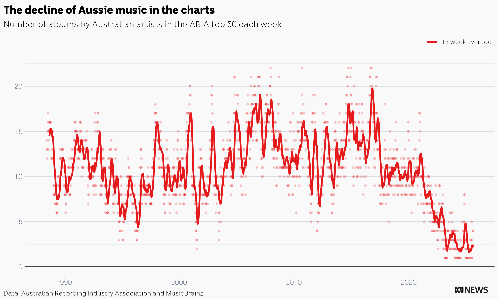
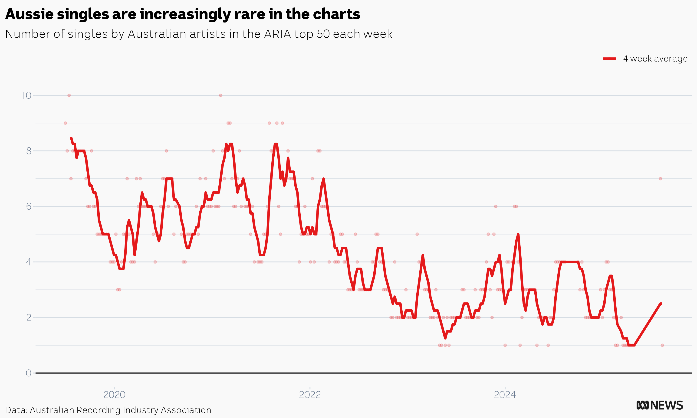

# ARIA chart data

Full ARIA chart data compiled by Casey Briggs and used in the the following ABC News reporting:

- [ABC News Video Lab program](https://www.youtube.com/watch?v=dpjYGTekLIY)
- [ABC News text story](https://www.abc.net.au/news/2023-07-09/australian-music-in-aria-charts-has-plummeted-heres-why/102575198)

We have checked this data set for errors sufficient for ABC reporting purposes, but neither I nor the ABC take responsibility for any issues that arise from further use of the data and you should satisfy yourself that it is suitable for your purposes before using.

It is possible that some errors in artist location data have snuck through. If you discover an error please file an issue or [get in touch](https://www.caseybriggs.com/)

While I may update this data set with new charts from time to time, I am not intending to do weekly updates.

This repository contains three csv files

### album_charts.csv

 

Chart data collected from the [ARIA website](https://www.aria.com.au/charts/singles-chart/) (data since July 2019) and [australian-charts.com](australian-charts.com) (prior to July 2019), and supplemented with data from MusicBrainz and manual data entry and correction.

Please see the important note below about the `location` column.

Dictionary:

- **chart_date**: the first day of each chart week as published by ARIA, always a Monday. australian-charts.com gives Sunday as the chart date, so data prior to July 2019 is time-shifted by six days to align with ARIA's dates.
- **rank**: The rank of the release in that week's chart 
- **artist**: The artist as it appeared on the ARIA charts
- **title**: The title of the release as it appeared on the ARIA charts
- **musicbrainz_name**: Where MusicBrainz has been used to find an artists location, this is the precise artist identified in the MusicBrainz search. Where we do not use MusicBrainz (for entries we manually entered or corrected and for all since July 2019), this field will record "NA" 
- **aus_flag**: TRUE if the artist is Australian, FALSE if otherwise 
- **location**: Where MusicBrainz has been used to find an artist's location, this is the location returned by the MusicBrainz search. Where MusicBrainz has not been used, this will record "Australia" or "non-Australian" **NOTE: these data sets were generated for the purposes of reporting on Australian music, and we have done no error checking of location beyond whether an artist is Australian or otherwise. Use this column at your own risk.**

Notes on location classification:

- If a single artist in a collaboration is Australian we count as Australian. If no artist in a collaboration is Australian then the location will be either assigned as the location of one of the artists (whichever one MusicBrainz identifies) or has been manually assigned as 'non-Australian' 
- Generally speaking, we accept MusicBrainz data in classifying artists (this means Nick Cave and Sia both count as Australian artists regardless of whether they live in Australia)
- We regard classical recordings published by ABC Classics as Australian music due to the performers.
- We align with the ARIA classification of Split Enz (Australian), Joji (Australian), and triple j Like a Version compilations (not Australian)
- Classification of other soundtracks and compilations is necessarily imperfect. As a general rule we classify tribute albums to Australian artists, soundtracks to Australian TV shows and movies where those soundtracks include a significant number of Australian artists, compilations of live recordings from Australian television and radio programs as Australian. This is likely to be the most subjective category of release.

### single_charts.csv

 

Collected from the [ARIA website](https://www.aria.com.au/charts/singles-chart/) (data since July 2019) and [australian-charts.com](australian-charts.com) (prior to July 2019)

Dictionary:

- **chart_date**: the first day of each chart week as published by ARIA, always a Monday. australian-charts.com gives Sunday as the chart date, so data prior to July 2019 is timeshifted by six days to align with ARIA's dates.
- **rank**: The rank of the release in that week's chart 
- **artist**: The artist as it appeared on the ARIA charts
- **title**: The title of the release as it appeared on the ARIA charts
- **aus_flag**: For charts since July 2019 only. TRUE if the artist is Australian, FALSE if otherwise. For older charts this will be NA 

### newsingle_charts.csv

Collected from the [ARIA website](https://www.aria.com.au/charts/new-singles-chart/). This chart was first published in 2022 and only publishes a top 20 each week

Dictionary:

- **chart_date**: the first day of each chart week as published by ARIA.
- **rank**: The rank of the release in that week's chart 
- **artist**: The artist as it appeared on the ARIA charts
- **title**: The title of the release as it appeared on the ARIA charts
- **aus_flag**: TRUE if the artist is Australian, FALSE if otherwise.

## Attribution and licensing 

It would be appreciated if users of this data also attribute data extraction to Casey Briggs and link to this repository. 

Charts are compiled each week by ARIA. MusicBrainz has published its data with a [CC0 license](https://creativecommons.org/publicdomain/zero/1.0) (public domain)

If you make use of this data set I'd love to know what you're doing with it, please [get in touch](https://www.caseybriggs.com/)
